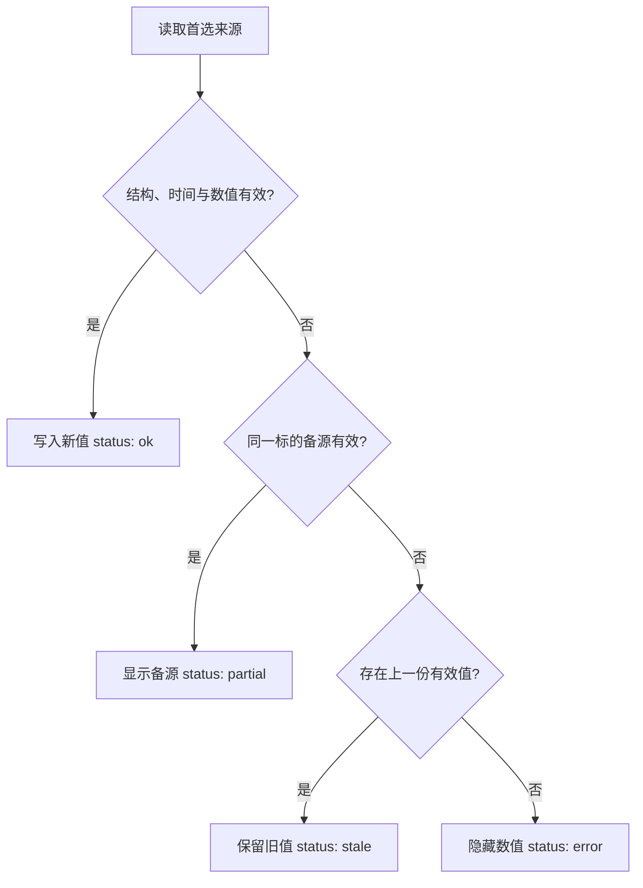

# 全球市场总览：真实数据接入规范

> 状态：4/8项已接入真实上游，4项等待公开展示许可
>
> 适用页面：`/apps/finance-terminal/`
>
> 适用资产：标普500、纳斯达克100、道琼斯指数、美国10年期国债收益率、美元指数、黄金、WTI原油、比特币
>
> 资料核对日期：2026-08-13

## 1. 本次结论

第一版真实数据仍采用“服务器端取数 → 生成静态JSON → 页面读取”的方式，不在浏览器中直接请求第三方API，也不宣称实时行情。

8项资产不能简单使用同一个免费接口：

- 美国10年期国债收益率、美联储广义美元指数和EIA WTI现货具有较清晰的官方公共来源。
- 比特币已复用现有全球资产榜的CoinGecko日度快照，并沿用同一管道的Yahoo `BTC-USD`明确降级；终端不新增浏览器请求、依赖或密钥。
- 标普500、纳斯达克100、道琼斯指数和LBMA黄金基准涉及第三方版权或再分发许可。技术上能取到数据，不等于可以在公开网站展示。
- ICE美元指数（DXY）也是专有基准。推荐第一版改用美联储广义美元指数并准确改名；如果必须显示DXY，则应先取得允许公开展示的数据许可。
- 许可未确认的资产继续使用明显标注的演示数据，不用来源不明的真实数值替换。

因此，后续应分资产渐进接入，而不是一次性把8张卡片全部切成真实数据。

四项待授权资产的当前决定已结构化保存在`apps/finance-terminal/market-source-readiness.json`，并由离线验证器和稳定V1门禁共同检查。2026-08-13项目所有者已选择精确原标的：`SPX`、`NDX`、`DJIA`与`LBMA Gold Price PM (USD/oz)`，不采用ETF代理。申请范围限定为个人爱好者、无广告/订阅/其他收入、日频或延迟公开网页展示；正式询价材料见`docs/FINANCE_TERMINAL_MARKET_LICENSE_INTAKE.md`。在取得可验证书面许可前，四项生产动作仍为`keep-demo`，不是“接口尚未写完”。

`SPY`、`QQQ`、`DIA`和`GLD`只保留为未选择的显式ETF代理候选。采用任一代理都会改变页面所称标的、代码与收益口径；除非项目所有者另行撤销当前决定，代码不得自动切换。

## 2. 必须先统一的展示口径

### 2.1 “价格”和“涨跌”不是同一种口径

| 资产类型 | 主数值 | 变化值 | 页面标签 |
|---|---|---|---|
| 股票指数 | 指数收盘点位 | 相对上一交易日收盘的百分比 | 日终收盘 |
| 美国10年期国债收益率 | 年化收益率（%） | 相对上一观测值的基点变化（bp） | 日频官方数据 |
| 美元指数 | 指数值 | 相对上一观测值的百分比 | 日频官方数据 |
| 黄金 | 美元/金衡盎司 | 相对上一观测值的百分比 | 日终基准或日度快照 |
| WTI原油 | 美元/桶 | 相对上一观测值的百分比 | 日频现货数据 |
| 比特币 | 美元价格 | 过去24小时变化百分比 | 日度快照 · 24小时涨跌 |

美国10年期国债收益率不得把收益率的相对百分比变化当作主要涨跌值。例如4.50%升至4.51%，应显示“+1 bp”，而不是“+0.22%”。

### 2.2 现货、期货、指数和ETF不得混用

- `GC=F`是COMEX黄金期货，不是黄金现货 `XAU/USD`。
- `CL=F`是NYMEX WTI近月期货，不是EIA的Cushing WTI现货价格。
- `SPY`、`QQQ`、`DIA`是ETF，不是标普500、纳斯达克100和道琼斯指数本身。
- 美联储广义美元指数 `DTWEXBGS` 不是ICE美元指数DXY。

如果以后主动采用代理标的，页面必须同步改名并显示“代理指标”；不得只换数据、不换名称。

### 2.3 `asOf`和`updatedAt`必须分开

- `asOf`：该数值实际对应的交易日或观测时点。
- `updatedAt`：Ooglex成功生成数据文件的时间，使用UTC ISO 8601。

周末或节假日可以出现“文件今天更新，但指数仍对应上一个交易日”的情况。页面必须优先展示 `asOf`，不能把文件更新时间冒充行情时间。

## 3. 八项资产的数据源决策

| ID | 推荐的最终名称与代码 | 目标标的 | 首选工程来源 | 第一版频率与标签 | 变化口径 | 过期判定 | 公开展示状态 |
|---|---|---|---|---|---|---|---|
| `sp500` | 标普500 `SPX` | S&P 500价格指数 | S&P DJI或其指定授权供应商 | 日频；日终或延迟 | 上一交易日收盘 | 超过2个美国交易日 | **询价已准备，需许可** |
| `nasdaq100` | 纳斯达克100 `NDX` | Nasdaq-100价格指数 | Nasdaq GIDS云接口或其指定授权供应商 | 日频；日终或延迟 | 上一交易日收盘 | 超过2个美国交易日 | **询价已准备，需许可** |
| `dow` | 道琼斯工业平均指数 `DJIA` | DJIA价格指数 | S&P DJI或其指定授权供应商 | 日频；日终或延迟 | 上一交易日收盘 | 超过2个美国交易日 | **询价已准备，需许可** |
| `us10y` | 美国10年期国债收益率 `DGS10` | 10年期恒定期限国债收益率 | 复用现有宏观雷达的FRED `DGS10` 数据管道 | 日频；日频官方数据 | 上一观测值，单位bp | 超过3个美国工作日 | **可实施** |
| `dxy` | 美联储广义美元指数 `DTWEXBGS` | 名义广义贸易加权美元指数 | FRED `DTWEXBGS` | 日频；日频官方数据 | 上一观测值 | 超过3个美国工作日 | **可实施，需改名** |
| `gold` | LBMA Gold Price PM `LBMA-GOLD-PM-USD` | 美元/金衡盎司下午基准 | ICE IBA或其指定授权再分发商 | 日频；伦敦午夜后延迟 | 上一伦敦工作日 | 超过2个伦敦工作日 | **询价已准备，需许可** |
| `wti` | WTI现货 `WTI` | Cushing, Oklahoma WTI Spot | EIA API v2，序列 `RWTC` | 日频；日频现货数据 | 上一发布观测值 | 超过4个美国工作日 | **可实施** |
| `bitcoin` | 比特币 `BTC/USD` | CoinGecko聚合的BTC美元价格 | 复用全球资产榜CoinGecko逐条行情；Yahoo `BTC-USD`为明确降级 | 每日一次；日度快照 | CoinGecko为过去24小时；Yahoo为较前收盘 | 超过36小时 | **已实施并署名** |

“公开展示状态”只表示当前是否具备清晰的接入路径，不构成法律意见。数据供应商条款改变时必须重新检查。

## 4. 各来源的具体要求

### 4.1 三大美国股票指数

FRED的历史页面可以帮助核对序列口径，但不作为本次许可与生产交付依据。精确原标的改为直接向S&P DJI申请`SPX`与`DJIA`公开展示权，并向Nasdaq申请`NDX`公开展示权；最终数据由权利人或其书面指定的授权供应商交付。

实施规则：

1. 在得到书面许可或选定带外部展示权的数据套餐前，三张卡片保持演示状态。
2. 不把Yahoo Finance未公开支持的图表接口视为长期生产合同。
3. 不用 `SPY`、`QQQ`、`DIA`静默替代指数。
4. 如果最终使用授权供应商，仍显示具体来源、收盘日期和“日终收盘”，不写“实时”。

### 4.2 美国10年期国债收益率

首选复用 `apps/macro-radar/data.json` 中已有的 `DGS10`，避免建立第二套FRED取数逻辑。该序列来自美联储H.15，单位为百分比，日频发布。

实施规则：

- 主数值保留两位小数并带 `%`。
- 变化值由最近两个有效观测值相减后乘以100，显示为整数或一位小数bp。
- FRED失败时先沿用宏观雷达上一份有效值并标记 `stale`。
- 只有在单独验证直接H.15读取逻辑后，才可将美联储H.15作为同标的备源。
- 使用FRED API的公开页面应按其条款显示“本产品使用FRED API，但未获圣路易斯联储认可或认证”的说明，并提供FRED API条款链接；第三方版权序列仍需分别处理许可。

### 4.3 美元指数

推荐第一版使用 `DTWEXBGS`，页面名称改为“美联储广义美元指数”，英文为“Nominal Broad U.S. Dollar Index”。它是美联储H.10的日频广义贸易加权指数，适合宏观研究，也比未经授权抓取DXY更稳妥。

实施规则：

- 本次不修改现有演示页面；改名应在未来接入任务中单独验收。
- 为保持旧页面兼容，内部资产ID可以暂时保留 `dxy`，但页面可见名称和代码必须改为 `DTWEXBGS`对应口径。
- `DTWEXBGS`不得仍显示代码 `DXY`。
- 如果项目所有者坚持显示ICE DXY，应先购买或取得允许公开展示的ICE/授权供应商数据，不能把 `DTWEXBGS`伪装成DXY。

### 4.4 黄金

LBMA页面明确说明，LBMA Gold Price由ICE Benchmark Administration管理，向第三方再分发可能需要相应许可。项目所有者已选择`LBMA Gold Price PM`美元/金衡盎司基准，并采用伦敦午夜后的延迟口径。当前仓库使用的`GC=F`是COMEX黄金期货，不能直接给该基准卡片使用。

实施规则：

- 在ICE IBA或其授权再分发商书面批准公开网页展示前，继续显示演示数据。
- 如果未来决定使用COMEX近月期货，卡片必须改名为“COMEX黄金期货”，代码改为对应合约，并说明换月方法。
- 黄金现货失败时不得自动降级为期货或GLD ETF；只能保留上一份相同标的的有效数据并标记过期。

### 4.5 WTI原油

推荐使用EIA的“Cushing, OK WTI Spot Price FOB”，而不是当前仓库中的 `CL=F`近月期货。EIA数据属于美国政府公开数据，允许使用和分发，但应显示EIA署名。

实施规则：

- 在接入前使用EIA API查询工具再次确认API v2路由和 `RWTC`字段，不凭猜测写死URL。
- API密钥使用GitHub Actions Secret `EIA_API_KEY`；不得放入前端、仓库或完整请求日志。
- EIA API密钥缺失或接口失败时，读取EIA官方公开日频历史页`RWTCD.htm`；只解析标题、美元/桶单位、周日期和最多8个最新观测点，页面结构或单位不符即拒绝发布。
- API与公开历史页属于同一EIA `RWTC`标的的两条访问路径，不得把后者描述成独立数据提供方；两者均失败时保留上一份有效值。
- EIA数据可能比交易日滞后，不以自然日统一判定过期。

### 4.6 比特币

终端复用`apps/asset-ranking/data.json`中唯一的`Bitcoin` / `BTC`逐条记录，不在页面或终端工作流新增一次CoinGecko调用。资产榜当前优先读取CoinGecko聚合BTC美元价格，失败时读取Yahoo `BTC-USD`价格；两者都失败才保留同标的上次快照。

实施规则：

- 第一版每天服务器端更新一次，因此页面显示“日度快照 · 24小时涨跌”，不显示“实时”。
- CoinGecko逐条记录必须是`mode: market`、`status: ok`、`frequency: daily`，价格为正数且24小时变化为有限数；否则终端拒绝把它标记为正常。
- BTC/USD卡片同时读取`asset-ranking/health.json`：CoinGecko行情必须能对应`coingecko`来源的同批`market`计数和最后成功时间；Yahoo降级必须对应`yahoo-finance`来源证据；历史回退必须存在逐源`fallback`计数。价格快照可读但健康证据缺失或错配时，卡片显示`UNKNOWN`，上线门禁直接阻断。
- 页面显示“Powered by CoinGecko”并链接到CoinGecko；署名不得被统一的文件来源摘要吞掉。
- Demo套餐不作为商业授权依据；若网站收费、商业化或用途超出所选套餐，应先切换至允许相应用途的套餐。
- 如果页面提供给其他用户使用，应同步准备适用的用户条款和隐私政策。
- 当前资产榜路径免密钥；本批不新增或假设任何Secret。未来若供应商要求密钥，只能放入GitHub Actions Secret或Cloudflare Secret，不进入浏览器。
- CoinGecko失败且Yahoo成功时，卡片来源切换为`Yahoo Finance · 静态流通量基准`、状态为`PARTIAL`，涨跌标签改为“较前收盘”；不得继续写“24小时涨跌”。
- CoinGecko与Yahoo都失败时，只接受`fallback`的同标的历史快照并标记`STALE`；估值、未知、不可用、重复BTC记录、未来时间或逐条时间与资产榜快照不一致均拒绝展示精确值。

## 5. 推荐的数据结构

真实数据不应直接覆盖当前演示文件，直到页面支持逐资产状态。建议下一阶段采用以下最小结构：

```json
{
  "schemaVersion": 1,
  "demo": false,
  "status": "partial",
  "updatedAt": "<UTC ISO 8601>",
  "assets": [
    {
      "id": "us10y",
      "name": "美国10年期国债收益率",
      "nameEn": "U.S. 10Y Treasury Yield",
      "symbol": "DGS10",
      "instrument": "yield",
      "price": "<number>",
      "priceUnit": "%",
      "change": "<number>",
      "changeUnit": "bp",
      "changePeriod": "previous_observation",
      "asOf": "<observation date or timestamp>",
      "updatedAt": "<UTC ISO 8601>",
      "frequency": "daily",
      "delayLabel": "日频官方数据",
      "status": "ok",
      "demo": false,
      "source": {
        "name": "FRED / Federal Reserve H.15",
        "url": "https://fred.stlouisfed.org/series/DGS10",
        "seriesId": "DGS10"
      },
      "licenseStatus": "approved",
      "note": "变化值以基点显示"
    }
  ]
}
```

补充规则：

- `price`和`change`在真实JSON中必须为JSON数值；上例中的占位符不能进入生产文件。
- `changePct`只用于百分比变化的资产；收益率卡片使用 `change`和 `changeUnit: "bp"`。
- 每张卡片拥有自己的 `demo`、`status`、`source`和时间字段，允许安全地逐项迁移。
- 只要8项中仍有演示数据，页面顶部就显示“部分项目仍为演示数据”，演示卡片还需单独带 `DEMO`标签。

## 6. 统一更新计划

第一版保持静态站点，不为了8项数据立刻引入D1或R2。

- 建议每天 `08:15 UTC`运行一次服务器端任务，包括周末，以覆盖比特币。
- 每个来源设置连接和读取超时；最多重试2次，使用短暂退避。
- 同一轮任务只请求所需的最近观测值，不下载无关完整历史。
- 百分比和bp变化在服务器端使用两条有效观测值统一计算；比特币24小时变化使用CoinGecko明确返回的字段。
- 生成临时结果并全部校验后再原子替换JSON。
- 为避免仓库提交膨胀，数值和状态无变化时不提交新文件。
- 等未来确有分钟级需求时，再单独评估Cloudflare Worker缓存；本阶段不使用前端轮询。

GitHub Actions的定时执行可能延迟，因此页面只能以实际 `updatedAt`和 `asOf`为准，不能以计划时间宣称准时或实时。

## 7. 故障回退流程



回退规则：

1. 备源必须是同一标的、同一单位和同一变化口径。
2. 来源变化必须进入JSON并展示在页面，不得静默切换。
3. ETF、期货或另一种美元指数不属于“同一标的备源”。
4. 只因单日波动很大不得自动删除真实值；应标记异常并等待复核，避免在危机日误判。
5. 不使用0、空数组或模拟值覆盖上一份有效真实数据。
6. 超过过期阈值后仍可保留最后数值供参考，但必须醒目标记“数据过期”，且不参与“今日涨跌”排序。
7. 页面加载失败、部分缺失、过期和许可未确认必须是不同状态。

## 8. 上线前的数据校验

每个资产至少检查：

- `id`、名称、代码和标的类型与本规范一致。
- 数值为有限数字且单位正确。
- `asOf`不晚于当前时间，且符合来源交易日或发布时间。
- 有两个有效观测值时，重新计算变化值并与输出核对。
- 过期判断使用对应市场的工作日，不统一使用自然日。
- 来源链接、序列ID、频率、延迟标签和许可状态均存在。
- API返回错误、空数据、字段缺失、时间过旧和备源切换都有测试夹具。
- 日内异常波动只触发告警，不静默篡改真实值。
- 日志中不出现API密钥或包含密钥的完整请求URL。

整体状态建议：

| 状态 | 条件 |
|---|---|
| `ok` | 8项均为已许可、未过期的真实数据 |
| `partial` | 至少一项使用备源、仍为演示或缺失，但页面仍可用 |
| `stale` | 多数核心资产只能使用过期数据 |
| `error` | 文件结构无效或没有可安全展示的数据 |

## 9. 实施顺序

后续仍遵守“一次一个模块”：

1. 先只把美国10年期国债收益率接入真实数据，复用现有 `DGS10`，同时让页面支持bp变化和逐卡状态。
2. 单独把美元卡片改为“美联储广义美元指数”并接入 `DTWEXBGS`。
3. 单独接入EIA WTI现货。
4. 已完成：复用资产榜接入CoinGecko比特币，并补齐署名、Yahoo降级、过期与失败隔离。
5. 已完成产品决定与三组询价材料；下一步由项目所有者补充真实法定姓名、居住国家/地区和联系邮箱并提交询价，取得书面展示许可后再逐项接入。

如果项目所有者不接受把DXY改为广义美元指数，应在第2步前暂停，由项目所有者选择“取得DXY许可”或“保留演示数据”。

## 10. 官方参考资料

- [FRED API观测值接口](https://fred.stlouisfed.org/docs/api/fred/series_observations.html)
- [FRED API使用条款](https://fred.stlouisfed.org/docs/api/terms_of_use.html)
- [FRED：S&P 500（SP500）](https://fred.stlouisfed.org/series/SP500)
- [FRED：NASDAQ-100（NASDAQ100）](https://fred.stlouisfed.org/series/NASDAQ100)
- [FRED：Dow Jones Industrial Average（DJIA）](https://fred.stlouisfed.org/series/DJIA)
- [S&P DJI数据与指数许可](https://www.spglobal.com/spdji/en/about-us/data-index-licensing/)
- [Nasdaq GIDS](https://www.nasdaq.com/solutions/global-indexes/data/gids)
- [Nasdaq Global Data联系页](https://www.nasdaqtrader.com/Trader.aspx?id=DPGlobaldata)
- [FRED：10-Year Treasury Yield（DGS10）](https://fred.stlouisfed.org/series/DGS10)
- [FRED：Nominal Broad U.S. Dollar Index（DTWEXBGS）](https://fred.stlouisfed.org/series/DTWEXBGS)
- [EIA：Cushing WTI Spot Price](https://www.eia.gov/dnav/pet/hist/rwtcd.htm)
- [EIA API技术文档](https://www.eia.gov/opendata/documentation.php)
- [EIA版权与复用说明](https://www.eia.gov/about/copyrights_reuse.php)
- [LBMA贵金属价格与许可说明](https://www.lbma.org.uk/prices-and-data/lbma-precious-metal-prices)
- [ICE IBA LBMA贵金属基准](https://www.ice.com/iba/lbma-precious-metals)
- [ICE U.S. Dollar Index Futures](https://www.ice.com/products/194/us-dollar-index-futures)
- [CoinGecko Simple Price接口](https://docs.coingecko.com/reference/simple-price)
- [CoinGecko API使用条款](https://www.coingecko.com/en/api_terms)
- [CoinGecko API套餐与数据新鲜度](https://www.coingecko.com/en/api/pricing)

## 11. 当前边界

- 终端页面不直接调用任何外部行情API；四项真实资产均读取站内静态数据管道。
- BTC/USD复用既有资产榜结果，不新增API密钥、GitHub Secret或运行依赖。
- 三大股票指数与黄金仍为醒目标注的演示数据，未用ETF、期货或来源不明的数值替换。
- 未合并`main`、未修改生产部署配置、未部署网站。
